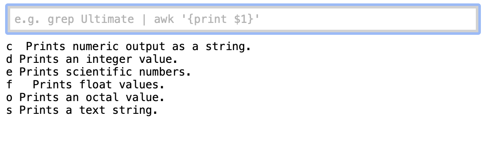
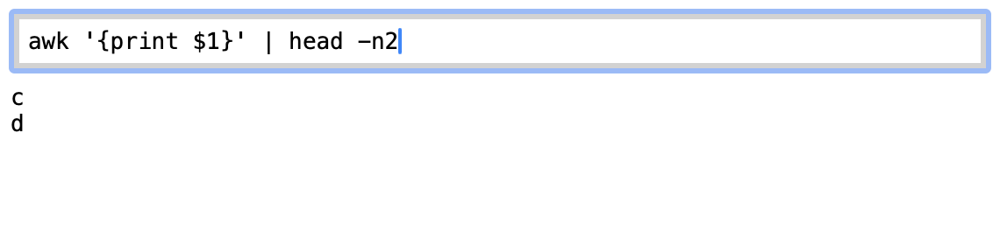

# bup - Ultimate Plumber for browser

## Usage

Redirect your command result to browser interactively, with instant live preview of command results, idea from <https://github.com/akavel/up>.

```
$ lshw |& bup
```

This would open your default browser with a simple webpath displayed.



Pipe your result.



Copy your result from the browser.

## Install

Make sure `go >= 1.21`

```bash
go install github.com/major1201/bup
```

## Why?

The existing tool [up](https://github.com/akavel/up) is useful and powerful enough, while in some cases it's better to use a browser rather than terminal.

1. It is quite slow with the large text to be displayed on terminal.
2. Scrolling in browser is much better than in terminal, both vertical and horizontal.
3. With the same width of the screen, browser typically shows more characters.
